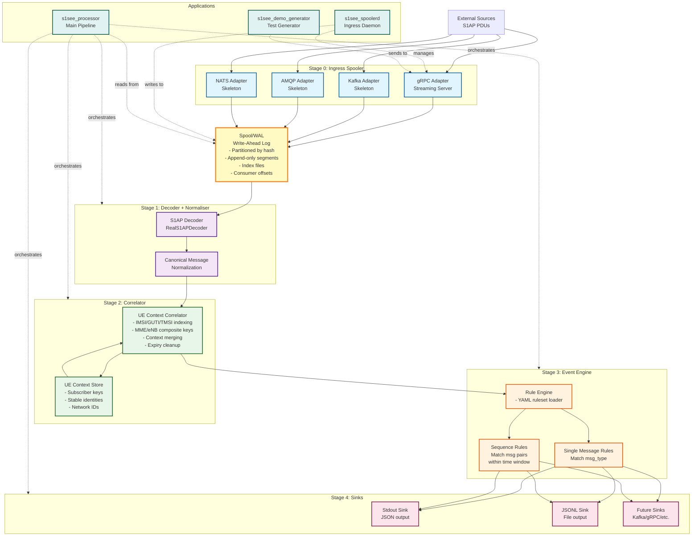

# S1-SEE Application Flow

This document contains a Mermaid diagram showing the complete flow through the S1-SEE application.

## Detailed Flow Description

### Stage 0: Ingress Spooler
- **gRPC Adapter**: Fully implemented streaming server that receives SignalMessage protobufs
- **Kafka/AMQP/NATS Adapters**: Skeleton implementations ready for integration
- All adapters write to the Spool before ACKing upstream (no-loss guarantee)

### Spool (Write-Ahead Log)
- **Partitioning**: Messages partitioned by hash(source_id + source_sequence)
- **Segments**: Append-only log files with index files for fast offset lookups
- **Consumer Groups**: Support for multiple independent consumers with offset tracking
- **Replay**: Full replay capability from any offset

### Stage 1: Decoder + Normaliser
- **S1AP Decoder** (`RealS1APDecoder`): 
  - Extracts S1AP PDUs from SCTP packets (PayloadProtocolID = 18)
  - Parses S1AP Information Elements using PER (Packed Encoding Rules) decoding
  - Extracts procedure codes and message types
  - Parses embedded NAS PDUs for additional identifiers
- **Normalization**: Converts to CanonicalMessage format with:
  - Message type mapping (HandoverRequest, InitialUEMessage, UEContextReleaseComplete, etc.)
  - UE identifiers (IMSI, TMSI, IMEISV, MME/eNB UE S1AP IDs)
  - TEIDs from E-RAB setup messages
  - ECGI (E-UTRAN Cell Global Identifier)
  - Decoded tree (JSON representation of information elements)
  - Spool offset references

### Stage 2: Correlator
- **S1apUeCorrelator**: Maintains subscriber records with all identifiers:
  - IMSI, TMSI, IMEISV (stable identifiers)
  - MME-UE-S1AP-ID, eNB-UE-S1AP-ID (temporary network identifiers)
  - TEIDs (GTP tunnel endpoint identifiers)
  - Tracks associations and handles identifier conflicts
- **UE Context Management**: Maintains UE contexts indexed by:
  1. IMSI (globally unique subscriber identifier)
  2. TMSI (temporary mobile subscriber identity)
  3. TMSI + ECGI (location-scoped)
  4. MME composite (mme_id + mme_ue_s1ap_id)
  5. eNB composite (enb_id + enb_ue_s1ap_id)
  6. IMEISV (device identifier)
- **Context Merging**: Handles handovers and network element changes
- **ID Removal**: Automatically removes S1AP IDs on UEContextReleaseComplete
- **Expiry**: Automatic cleanup of expired contexts

### Stage 3: Event Engine
- **Rule Engine**: Loads YAML rulesets and evaluates rules
- **Single Message Rules**: Match on message type (e.g., "HandoverRequest" → "Mobility.Handover.Commanded")
- **Sequence Rules**: Match message pairs within time windows (e.g., "HandoverRequest" + "HandoverNotify" → "Mobility.Handover.Completed")
- **Evidence Chain**: Every event includes spool offsets pointing to source messages

### Stage 4: Sinks
- **Stdout Sink**: Emits events as JSON to stdout
- **JSONL Sink**: Writes events to JSONL file (one event per line)
- **Future Sinks**: Architecture supports Kafka, gRPC, and other output formats

## Data Flow Example

1. **Ingest**: External source sends S1AP PDU via gRPC → gRPC Adapter receives it
2. **Spool**: Adapter writes SignalMessage to Spool (partitioned, indexed) → ACKs upstream
3. **Read**: Processor reads from Spool at consumer offset
4. **Decode**: S1AP PDU extracted from SCTP, parsed, normalized to CanonicalMessage
5. **Correlate**: Message matched to UE context (by IMSI, TMSI, etc.), context updated
6. **Rule Match**: Rule engine checks single-message and sequence rules
7. **Emit**: If rule matches, Event created with evidence chain → sent to all sinks
8. **Output**: Event appears in stdout and JSONL file

## Key Features

- **No-loss upgradeability**: Messages spooled before ACK
- **Evidence chain**: Every event links to spool offsets
- **Deterministic replay**: Replay from spool produces identical events
- **Transport-agnostic**: All transports feed unified SignalMessage model
- **Declarative rules**: YAML-based event rules

